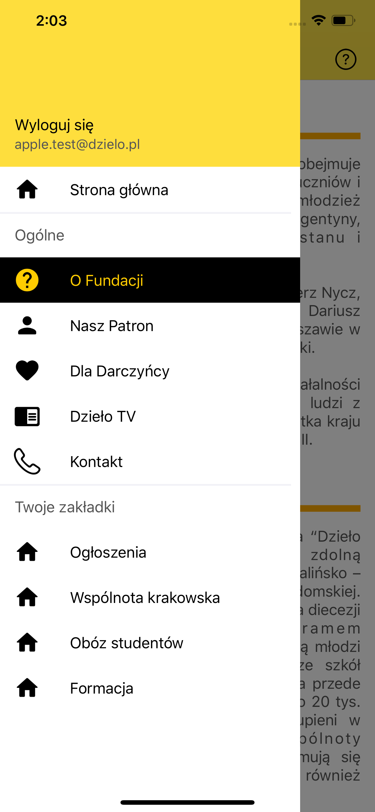
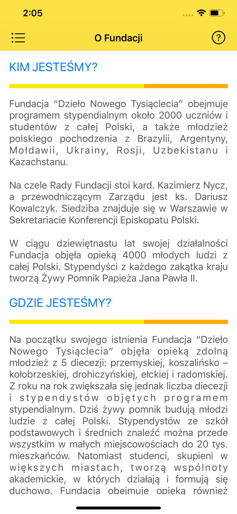
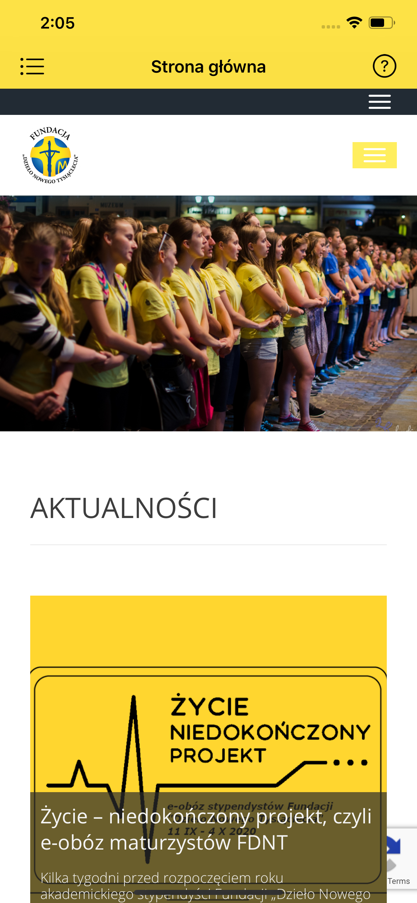

# FDNT

App is directed mainly to the community of the 'Dzieło Nowego Tysiąclecia' Foundation and its main goal is to improve communication between members.

# Table of contents

1. [Overview](#overview)
2. [Screenshots](#screenshots)
3. [Technologies](#technologies)
4. [Current status](#current-status)

## Overview

The app's current features are:

- **Foundation's mailing platform**: WIP - currently allows for reading only.
- **Singing into community account**: All the members have access to their foundation accounts.
- **Foundation newsletter**: Recent news from community life.
- **Board members contact information**: Emails and phone numbers of management and board staff.
- **Specific subcommunity's tabs**: Every signed in user is assigned to specific subcommunities.
- **Donation info**: Potential donators may find details about donation to foundation. 

## Screenshots

  
   
  

## Technologies

- Xcode 11.7 with Swift 5.2.4
- Cocoapods 1.9.3
- Firebase 6.32.2
- AppAuth 1.4.0
- mailcore2-ios 0.6.4
- SwiftKeychainWrapper 4.0.1
- BartyCrouch 4.0.2

## Current status

The application in its current version, published on App Store is made to be the equivalent of Android app.
The new versions will feature remade UI with navigation bar on the bottom according to the latest [design project](https://xd.adobe.com/view/edb9d13d-321f-4b28-9234-a8bef5eda09d-b8ea/).
